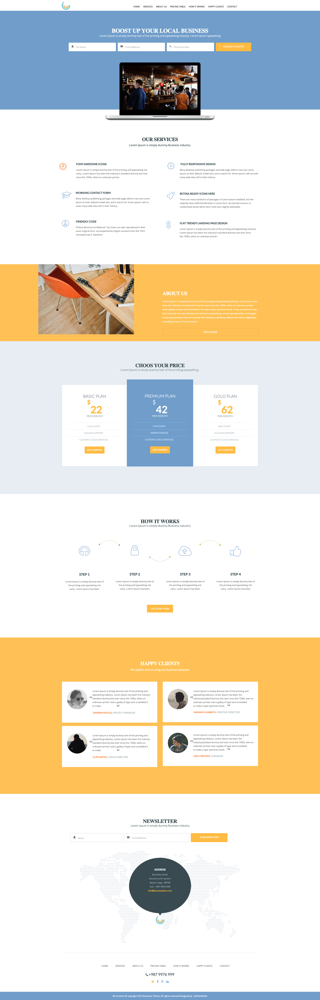

# Boost up your Local business

Репозиторий содержит PSD файлы, включая макеты, слои и элементы дизайна, готовые для использования для создания веб-сайта.

## Описание

Этот репозиторий представляет PSD макет домашней страницы портфолио под названием Boost up your Local business. Используйте этот макет в качестве основы для разработки веб-сайта, изучая макеты, слои и элементы дизайна.

## Структура проекта

- `style.css/`: Файл стиля сайта.
- `images/`: Папка содержащая изображение.
- `README.md`: Этот файл с описанием проекта.

## Использование

1. Загрузите PSD файлы и откройте их в Photoshop или другой программе, поддерживающей формат PSD.
2. Изучите макеты, слои и элементы дизайна для создания веб-сайта.
3. Используйте элементы дизайна в своем проекте веб-разработки.

https://gaminghackintosh.github.io/Boost-up-your-Local-business---PSD

